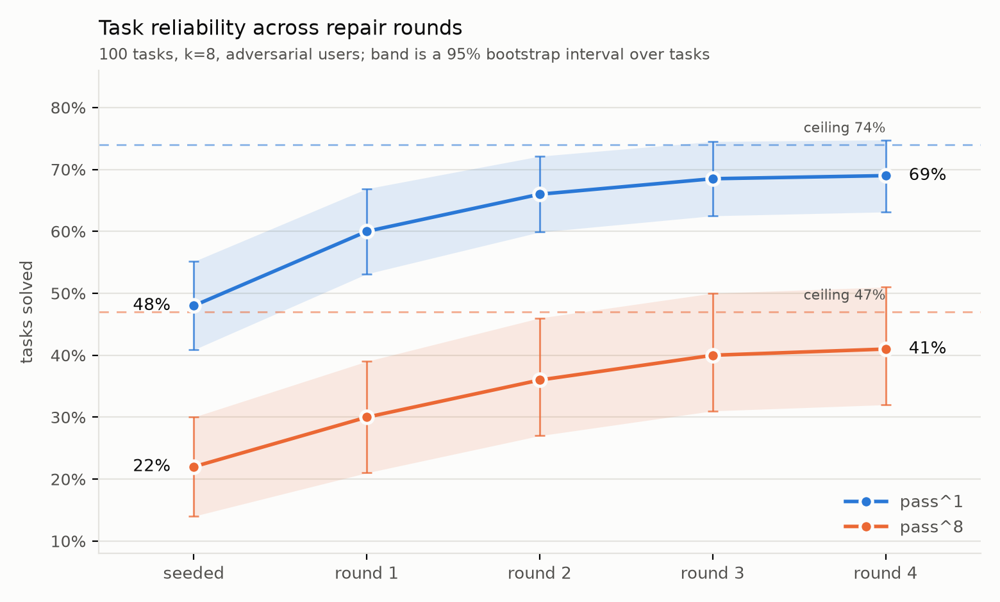

# agent-repair

**Agent infrastructure that repairs its own tools: failures are attributed to the tool interface responsible, the MCP schema is rewritten, and revisions ship only after passing a variance-aware regression gate.**

---

## Overview

Tool-calling agents exhibit a class of failures that is routinely misattributed to the model. When a tool's description is underspecified, its error returns are silent, or its parameter semantics are ambiguous, the agent selects the wrong tool, constructs invalid arguments, or enters retry loops. The instability is documented: on τ-bench's retail domain, GPT-4o completes 61% of tasks in a single attempt but only about 25% consistently across eight, and MAST attributes 41.8% of agent failures to specification issues rather than model capability (a multi-agent taxonomy, so the figure transfers only partially to single-agent tool use). In current practice, interface defects are located and corrected manually, by engineers reading traces.

This system automates that repair loop. An agent is exercised against simulated difficult users; each failure is classified by a calibrated LLM judge, attributed to the tool interface responsible, and used to generate a revision of that tool's MCP schema, covering the description, error messages, and parameter types. A revision is deployed only if it passes a regression gate: the full task suite re-run at k=8 samples per task, compared with paired bootstrap statistics, under the requirement that reliability on the failing tasks improves with no statistically significant regression elsewhere. A literal no-degradation criterion would be unusable here; with 100 tasks at k=8, some task drops on essentially every re-run by chance alone, which is precisely why the gate is statistical.

The gate, more than the rewriting, is the substantive component. Drafting a schema revision is easy for a language model; determining whether that revision helps, harms elsewhere, or expands the tool's permission surface is an evaluation problem. Of 31 proposed revisions, the gate accepted 19, rejected 9 whose target-task gains concealed regressions on other tasks, and blocked 3 that widened tool permissions, defined as new scopes, newly reachable endpoints, relaxed parameter constraints, or removal of a documented restriction.

Evaluation uses controlled fault injection, in the tradition of mutation analysis and seeded-defect benchmarks: measuring a repair system requires ground truth about what is broken. I audited public MCP servers, catalogued 8 recurring interface defect patterns, including undocumented enumeration values, silent empty returns on error, and ambiguous datetime formats, and seeded a working 14-tool commerce-domain server with 24 graduated instances. The catalog is published in `defects.md`. Under adversarial user simulation, four repair rounds raise task reliability from 48% to 69% and repair 17 of the 24 seeded defects, with model weights unchanged throughout. Reliability recovery (81% of the gap to hand-tuned interfaces) runs ahead of defect recovery (71%): the loop preferentially fixes the defects that cause the most failures.

A secondary result concerns evaluation conditions. On scripted versions of the same tasks, the seeded suite scores 59% against 48% adversarial, and the repaired suite 81% against 69%. Cooperative benchmarks overstate deployed reliability by a roughly constant 11 points at both ends, consistent with the motivation for user simulation in τ-bench.



## Results

100 tasks in a commerce and support domain, k=8 runs per task per evaluation, adversarial user simulation throughout. Round-over-round comparisons are paired across tasks with bootstrap confidence intervals.

| Tool suite | pass^1 | pass^8 | pass^8 / pass^1 |
|---|---|---|---|
| Seeded (defective) | 48% | 22% | 0.46 |
| After self-repair, round 4 | 69% | 41% | 0.59 |
| Hand-tuned ceiling | 74% | 47% | 0.64 |

- Reliability across rounds: 48 → 60 → 66 → 68.5 → 69. The cumulative gain is +21 points, 95% CI [+15, +27]; the round 3 to 4 increment is +0.5, CI [−6, +7], and is reported as a plateau because the interval includes zero.
- pass^8 falls well below pass^1 for every suite, and the pass^8/pass^1 ratio rises with interface quality (0.46 → 0.59 → 0.64): better tool specifications reduce run-to-run variance, not just mean reliability. The seeded ratio sits near τ-bench's published figure for a capable agent on unmodified retail tools.
- The failure classifier is an LLM judge calibrated against 200 hand-labeled traces (Cohen's κ = 0.84). Class distribution: wrong tool selection 38%, malformed arguments 24%, loops 14%, context loss 12%, premature termination 8%, agent-attributable rather than tool-attributable 4%.

## Method

```
simulator (LangGraph)  →  agent + MCP tool server (14 tools)  →  failure traces
        difficult-user personas                                   ↓
regression gate (pass^k, paired bootstrap)  ←  optimizer  ←  classifier (LLM judge)
        accepted revisions → tool schemas
```

The simulator implements difficult-user personas: underspecified requests, mid-task goal changes, incorrect information, and abandonment pressure. Attribution maps each classified failure to a specific tool interface, with a separate class for failures attributable to the agent rather than any tool. The optimizer proposes targeted schema revisions. The gate re-evaluates the full suite and accepts a revision only under paired improvement without significant collateral regression; permission-expanding revisions are rejected categorically, independent of measured gains. Repairs apply between runs; the system does not modify itself mid-task.

## Regression gate analysis

The gate's rejections quantify what weaker acceptance criteria would have deployed. Nine revisions improved their target task while regressing others; under point-estimate comparison all nine would have been promoted, and even a k=1 gate would have shipped six of them. Three revisions expanded tool permissions and were rejected on that criterion alone. For infrastructure that modifies its own configuration, the evaluation suite functions as change control, and these counts are the evidence that the control is necessary.

## Current and Future Work

The scope above is complete. Current work: validating the loop across agent models, since the design is model-agnostic and has been verified on one; applying the repairer to real public MCP servers rather than seeded defects; and multi-tool interaction defects, where two individually well-specified interfaces are jointly ambiguous. Once this stage is complete, a complete reproduce section will be added.

## Relation to prior work

DSPy and its descendants optimize prompts from execution feedback. τ-bench contributes pass^k and user simulation for agent evaluation; MAST contributes a failure taxonomy with a calibrated LLM judge. Observability platforms trace and classify failures but do not act on them. To my knowledge, no open system closes the loop with the tool schema as the optimization target and a variance-aware gate deciding deployment. All components are standard: MCP, LangGraph, LLM-as-judge, pass^k, paired bootstrap comparison.

## Limitations

One domain and one seeded-defect distribution; transfer to arbitrary tool suites is untested. Single agent model. The repair trajectory is a single run of the loop, so round-by-round values carry more uncertainty than the endpoint comparison, which is where the confidence interval lives. The defect catalog and the hand-tuned ceiling are both mine; an externally validated ceiling is future work. The optimizer inherits the judge's misclassifications, bounded but not eliminated by the κ = 0.84 calibration. Repairs are between-run only.

## Citations

Model Context Protocol (Anthropic, 2024) · τ-bench (Yao et al., 2024) · MAST (Cemri et al., 2025) · DSPy (Khattab et al., 2023) · LangGraph · Mutation analysis (DeMillo et al., 1978) · Bootstrap methods (Efron & Tibshirani)
